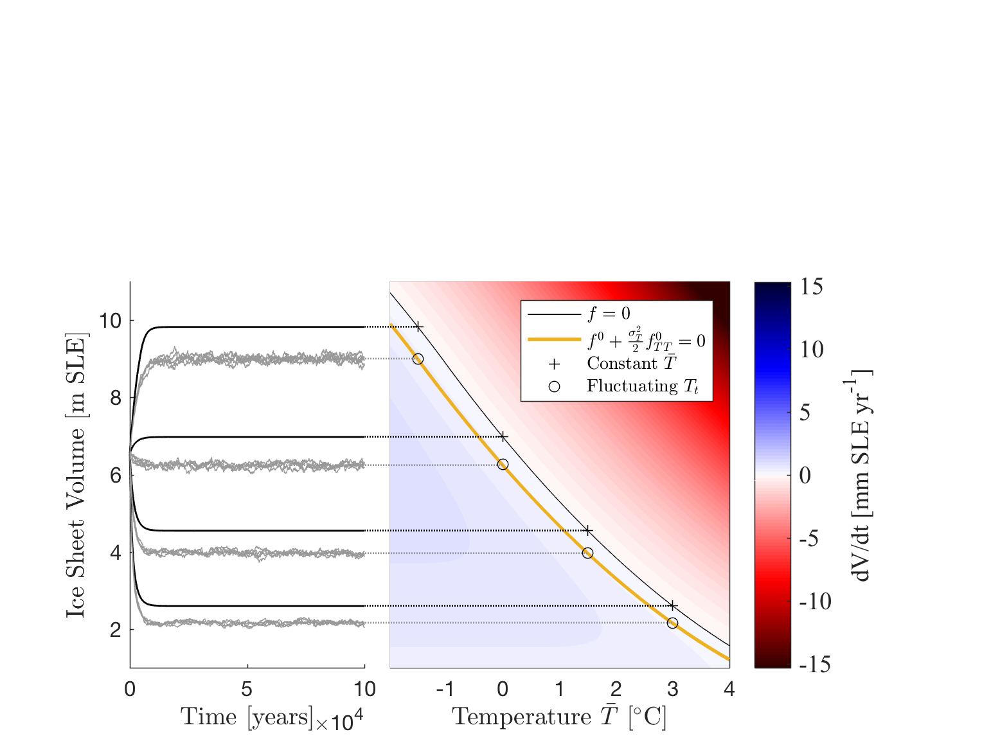
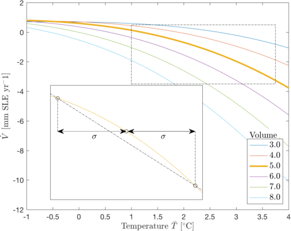
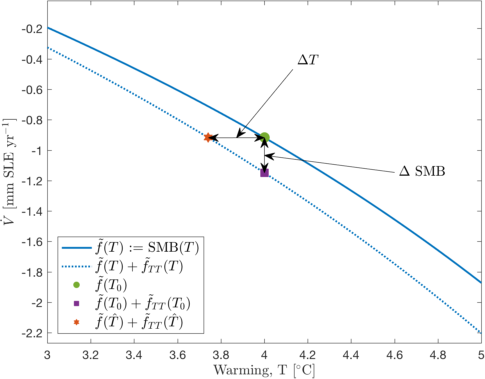
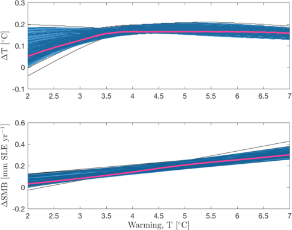
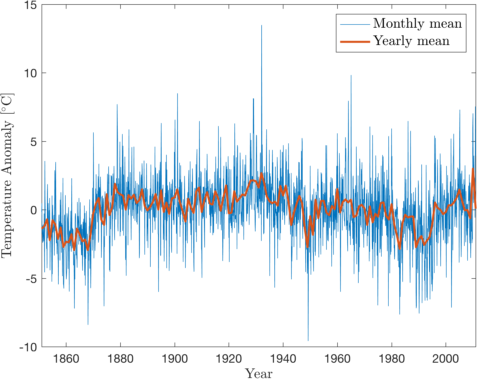

**MATLAB and Jupyter notebook files for **
** "Influence of temperature fluctuations on equilibrium ice sheet volume"**

**Assumes the following packages are installed**

* [export_fig](https://se.mathworks.com/matlabcentral/fileexchange/23629-export-fig "export_fig")  by Yair Altman

* 
[Data space to figure units conversion](https://se.mathworks.com/matlabcentral/fileexchange/10656-data-space-to-figure-units-conversion "ds2nfu") by Michelle Hirsch

* [hslcolormap](https://se.mathworks.com/matlabcentral/fileexchange/48586-hslcolormap "hslcolormap") by Aslak Grinsted

* [suplabel](https://se.mathworks.com/matlabcentral/fileexchange/7772-suplabel "suplabel") by Ben Barrowes

* [matrix2latex](https://se.mathworks.com/matlabcentral/fileexchange/4894-matrix2latex "matrix2latex") by Moritz Koehler

**File descriptions**

* `data/ar1results.mat`

* `data/GreenlandTemperatureData.txt`

* `greenlandTemperature.m`

* `icesheetsCrossterms.m`

* `icesheetsRobinson.m`

* `icesheetsSetup.m`

* `icesheetsSimulations.m`

* `icesheetsStepsize.m`

* `iceTotal.m`

* `iceVolume.m`

* `MassBalanceSketch.ipynb`

* `oerlemansModel.m`

* `oerlemansParam.m`

* `simnumber.m`

**Workflow**

1.

**Figures in the article**

* Figure 1: `icesheetsSimulations.m`

* Figure 2: `icesheetsSimulations.m`

* Figure 3: `icesheetsRobinson.m`

* Figure 4: `icesheetsRobinson.m`

**Figures in the supplement**

* Figure S1: `MassBalanceSketch.ipynb`

* Figure S2: `icesheetsStepsize.m`

* Figure S3: `greenlandTemperature.m`

* Figure S4: `icesheetsCrossterms.m`

* Figure S5: `icesheetsRobinson.m`

* Figure S6: `icesheetsRobinson.m`

