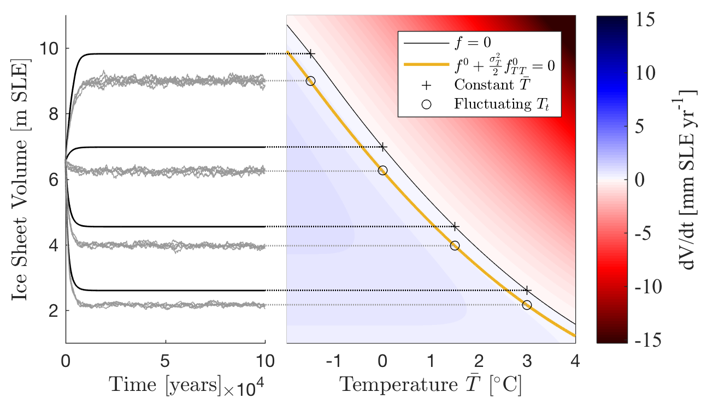
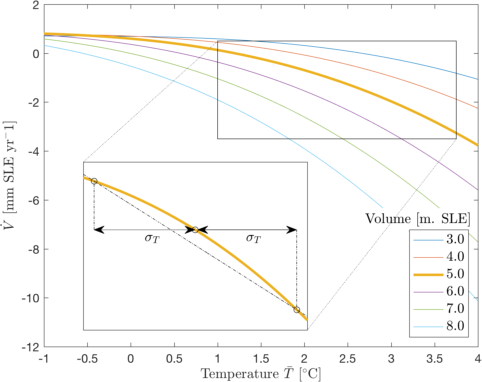
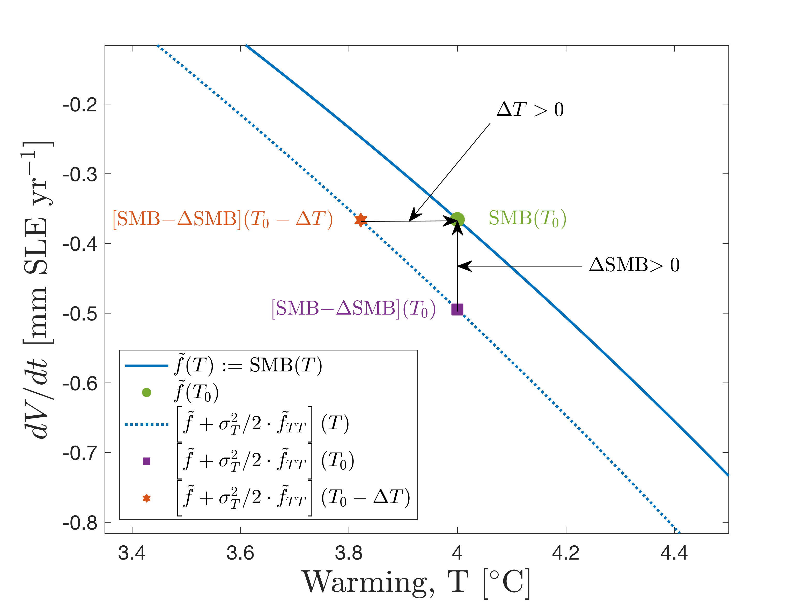
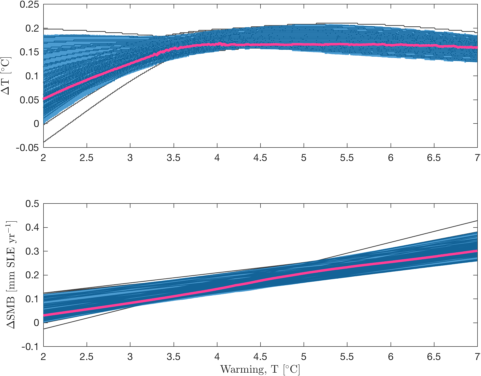
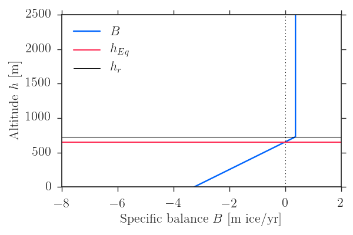
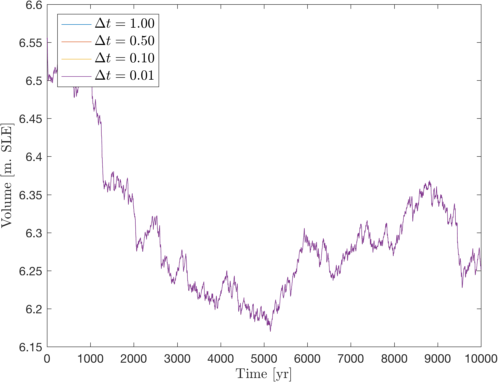
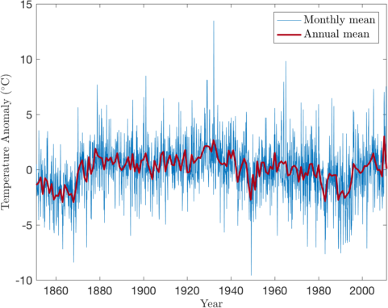
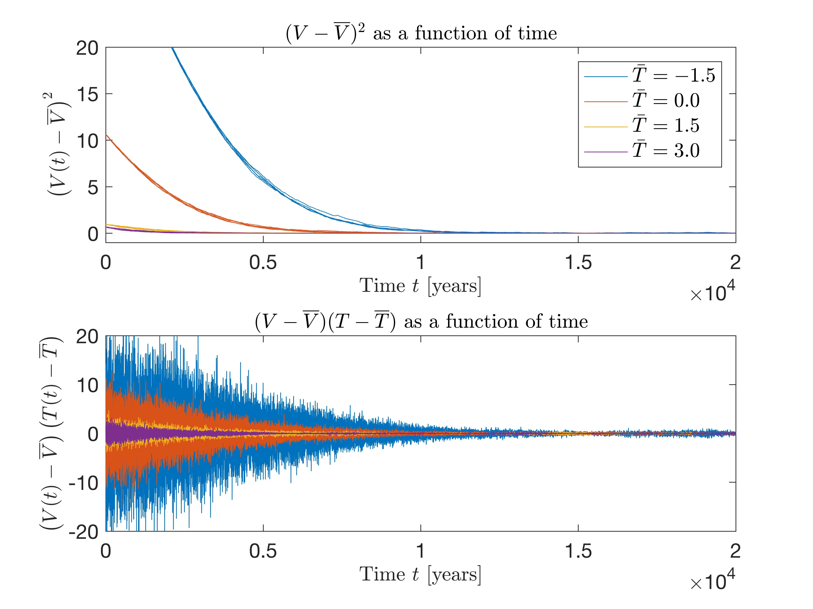
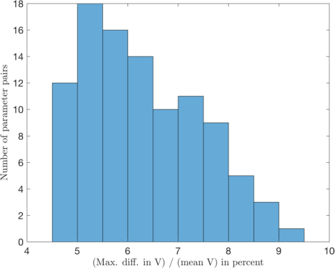
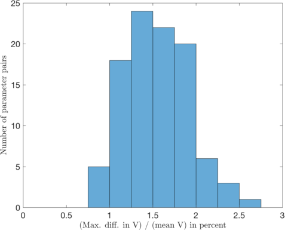

**MATLAB and Jupyter notebook files for **
** "Influence of temperature fluctuations on equilibrium ice sheet volume"**

We greatly acknowledge the work by the authors of the following papers upon
which we build:

* Oerlemans, J. (2003), *A quasi-analytical ice-sheet model for climate studies*,
Nonlinear Processes in Geophysics, 10(4/5), 441–452,
doi: [10.5194/npg-10-441-2003](https://dx.doi.org/10.5194/npg-10-441-2003).

* Robinson, A., R. Calov, and A. Ganopolski (2012), *Multistability and critical
thresholds of the Greenland ice sheet*, Nature Climate Change, 2(6), 429–432,
doi:
[10.1038/nclimate1449](https://dx.doi.org/10.1038/nclimate1449).

* Fettweis, X., B. Franco, M. Tedesco, J. H. van Angelen, J. T. M. Lenaerts,
M. R. van den Broeke, and H. Gallée (2013), *Estimating Greenland ice sheet
surface mass balance contribution to future sea level rise using the regional
atmospheric climate model MAR*, The Cryosphere, 7, 469–489, doi:
[10.5194/tc-7-469-2013](https://dx.doi.org/10.5194/tc-7-469-2013).

**MATLAB scripts assume the following packages are installed:**

* [export_fig](https://se.mathworks.com/matlabcentral/fileexchange/23629-export-fig "export_fig")  by Yair Altman

* [ds2nfu](https://se.mathworks.com/matlabcentral/fileexchange/10656-data-space-to-figure-units-conversion "ds2nfu") by Michelle Hirsch

* [hslcolormap](https://se.mathworks.com/matlabcentral/fileexchange/48586-hslcolormap "hslcolormap") by Aslak Grinsted

* [suplabel](https://se.mathworks.com/matlabcentral/fileexchange/7772-suplabel "suplabel") by Ben Barrowes

* [matrix2latex](https://se.mathworks.com/matlabcentral/fileexchange/4894-matrix2latex "matrix2latex") by Moritz Koehler

**File descriptions**

* `data/ar1results.mat`
Contains AR(1)-coefficient and variance from fitting an AR(1)-model
to annual Greenland reanalysis data.
Created by `greenlandTemperature.m`.

* `data/GreenlandTemperatureData.txt`
Contains monthly reanalysis data from climexp.knmi.nl (see the file for a
description).

* `greenlandTemperature.m`: Loads Greenland temperature data and fits an
AR(1) model. Calculates simple diagnostics on the model.
This is done after loading `GreenlandTemperatureData.txt`.
Saves results in `data/ar1results.mat`.
Makes Figure S3 in the supplement.

* `icesheetsCrossterms.m`
Evaluates the contribution from the cross and volume variance terms
in equation (3) in the article and makes Figure S4.

* `icesheetsRobinson.m`
Applies effect of fluctuating temperature to Robinson et al.'s results.
Makes Figures 3 and 4 in the article and Figures S5 and S6 in the supplement.

* `icesheetsSetup.m`
Common script setup. Contains path and font size variables etc.

* `icesheetsSimulations.m`
Integrates the Oerlemans (2003) model with  fluctuating temperature
and makes Figures 1 and 2 in the article.

* `icesheetsStepsize.m`
Evaluates the consequences of the chosen integration time step size for
the Oerlemans model and makes Figure S2.

* `iceTotal.m`
Utility function to ease the use of `iceVolume.m`.

* `iceVolume.m`
Calculates the ice sheet volume given the radii of the 1) ice sheet
and 2) the continent upon which the ice sheet rests.

* `MassBalanceSketch.ipynb`
Sketches the mass balance as a function of altitude for the Oerlemans
(2003) model and makes Figure S1.

* `oerlemansModel.m`
The Oerlemans (2003) model.

* `oerlemansParam.m`
Contains parameters for the simulations.

* `simnumber.m`
Convert from parameter values and warming value to simulation number
in Robinson et al.'s (2012) data.

**Workflow**

1. Run `greenlandTemperature.m` to fit an AR(1) model to reanalysis data
2. Decide whether to comment/uncomment
  * `save_pdf` and `save_png` to save figures
3. Decide whether to comment/uncomment
  * `thisrun = production` or `thisrun = test` in `icesheetsSimulations`
  to save time
4. Run scripts to make figures and print out data

**Figures in the article**

* Figure 1: `icesheetsSimulations.m`

* Figure 2: `icesheetsSimulations.m`

* Figure 3: `icesheetsRobinson.m`

* Figure 4: `icesheetsRobinson.m`

**Figures in the supplement**

* Figure S1: `MassBalanceSketch.ipynb`

* Figure S2: `icesheetsStepsize.m`

* Figure S3: `greenlandTemperature.m`

* Figure S4: `icesheetsCrossterms.m`

* Figure S5: `icesheetsRobinson.m`

* Figure S6: `icesheetsRobinson.m`

